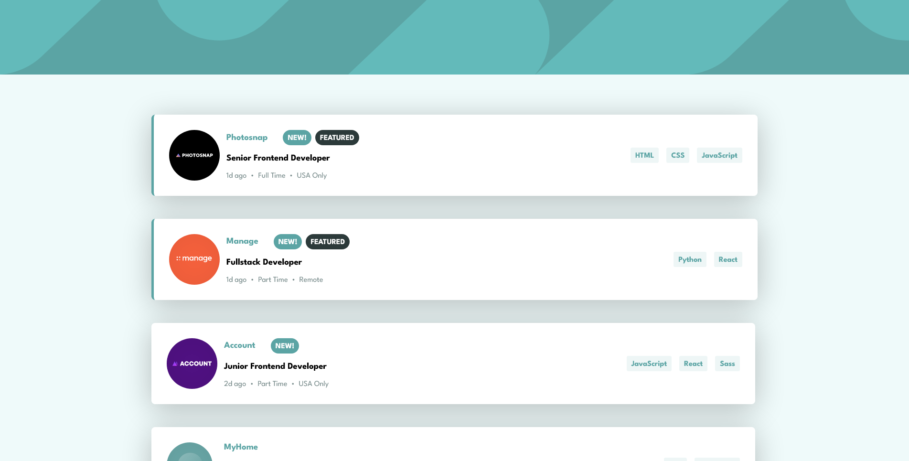
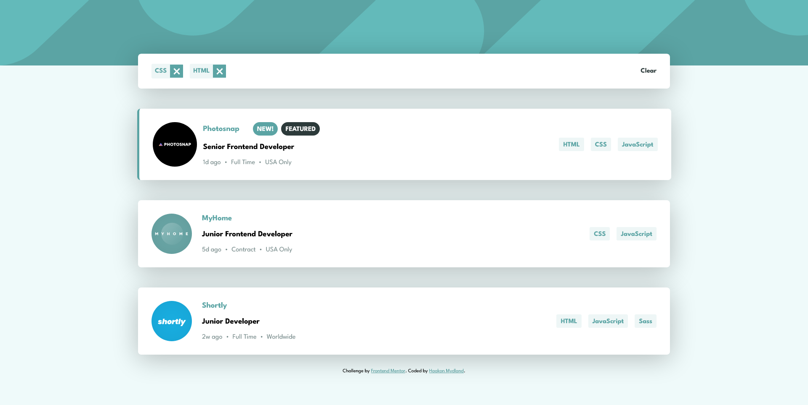
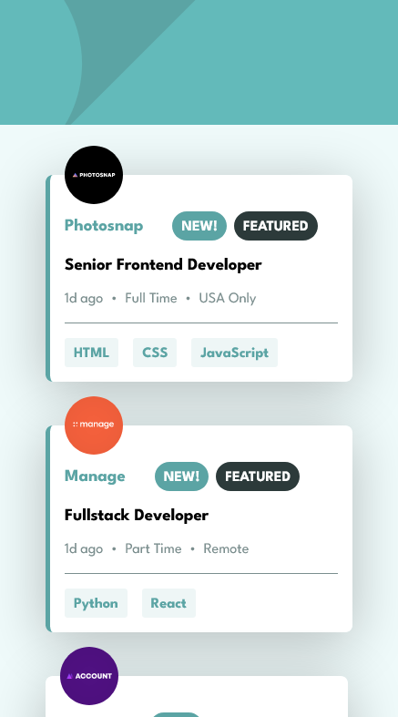
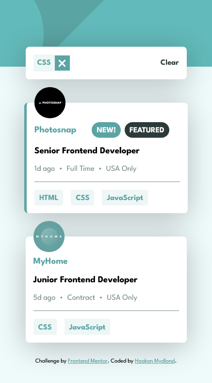

# Frontend Mentor - Job listings with filtering solution

This is a solution to the [Job listings with filtering challenge on Frontend Mentor](https://www.frontendmentor.io/challenges/job-listings-with-filtering-ivstIPCt). Frontend Mentor challenges help you improve your coding skills by building realistic projects.

## Table of contents

- [Overview](#overview)
  - [The challenge](#the-challenge)
  - [Screenshot](#screenshot)
  - [Links](#links)
- [My process](#my-process)
  - [Built with](#built-with)
  - [What I learned](#what-i-learned)
- [Author](#author)

## Overview

### The challenge

Users should be able to:

- View the optimal layout for the site depending on their device's screen size
- See hover states for all interactive elements on the page
- Filter job listings based on the categories

### Screenshots






### Links

- Solution URL: [Add solution URL here](https://your-solution-url.com)
- Live Site URL: [Add live site URL here](https://your-live-site-url.com)

## My process

### Built with

- Semantic HTML5 markup
- CSS custom properties
- Flexbox
- CSS Grid
- Mobile-first workflow
- [TypeScript](https://www.typescriptlang.org/)
- [React](https://reactjs.org/) - JS library

### What I learned

This project was one of the more involved ones from frontend Mentor I've worked on this far. I'm still working on learning React and this project felt like a perfect fit.

I got to work a bit with states and state management, setting states from child components and a lot of list filtering.

I ended up using "useEffect" from react to change create a new property for the data items. It's just a mashup of tools and languages, to make it easier to filter based on them later on.

```tsx
useEffect(() => {
  setlistings((prev: Array<string>) => {
    let temp: Array<string> = [];
    prev.forEach((element: any) => {
      element.filters = [...element.tools, ...element.languages];
      temp.push(element);
    });

    return [...temp];
  });
}, [0]);
```

I'm still trying to understand typescript and types better, but I'm getting somewhere i think.

This function is set up to loop through the job listings in the data and create a job listing element for each one. In addition to sending the job listing info to the element I also send a function to set a state.

```tsx
{
  listings
    .filter((listing: ListingInterface) =>
      listing?.filters?.some((filter: never) => filters.includes(filter))
    )
    .map((listing: ListingInterface) => (
      <Listing data={listing} key={listing.id} stateChanger={handleChange} />
    ));
}
```

In the element I loop through the languages and tools to add buttons for the job listings. I then add a onclick function where I give the name of the tool or language as a argument.

```tsx
{
  data.languages.map((lang: string) => (
    <p
      key={`${data.id} ${lang}`}
      className={style.Language}
      onClick={() => stateChanger(lang)}
    >
      {lang}
    </p>
  ));
}
{
  data.tools.map((tool: string) => (
    <p
      key={`${data.id} ${tool}`}
      className={style.Tool}
      onClick={() => stateChanger(tool)}
    >
      {tool}
    </p>
  ));
}
```

Back in the app the function executes with the argument and if that argument is not already added to the filters state, it gets added.

```tsx
const handleChange = (newValue: never) => {
  if (!filters.includes(newValue)) {
    setfilters((prev) => {
      return [...prev, newValue];
    });
  }
};
```

## Author

- Website - [Haakon Mydland](https://www.haakonmydland.com/home)
- Frontend Mentor - [@haakonmydland](https://www.frontendmentor.io/profile/haakonmydland)
- Twitter - [@haakonmydland](https://www.twitter.com/haakonmydland)
